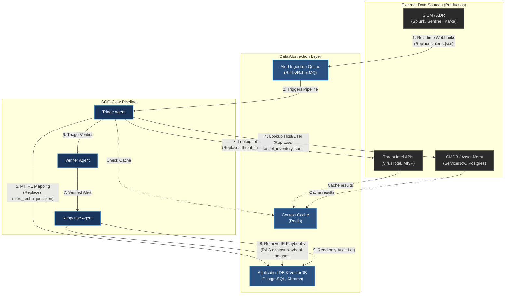

# Production Data Architecture

In a production environment, the static JSON files currently in `soc_claw/data` will be replaced by dynamic connections to enterprise security and IT systems. SOC-Claw will act as an orchestration layer, pulling in real-time data from these external sources.

## Current vs. Production Mapping

| Current Mock Data | Production Source Type | Real-World Examples | Integration Method |
| :--- | :--- | :--- | :--- |
| `alerts.json` | **SIEM / XDR Platform** | Splunk, Microsoft Sentinel, Elastic Security, CrowdStrike | Webhooks, REST API, Kafka/PubSub stream |
| `threat_intel.json` | **Threat Intelligence Platform (TIP)** | VirusTotal, MISP, Recorded Future, ThreatConnect | REST API, STIX/TAXII feeds |
| `asset_inventory.json` | **CMDB / Asset Management** | ServiceNow, AWS/Azure API, Device42, Jamf | REST API, PostgreSQL, GraphQL |
| `mitre_techniques.json`| **Knowledge Base (Threat)** | MITRE ATT&CK Framework | PostgreSQL Database (synced periodically), Redis Cache |
| `incident_response_playbook_dataset.jsonl` | **Knowledge Base (Playbooks)** | SOAR Playbook Library, Vector Database | RAG via VectorDB (Pinecone/Chroma), Fine-tuned Model |

## Production Architecture Diagram

Here is a high-level picture of how data would flow in a production environment:

### Answering Your Questions

Yes, the sources can absolutely be APIs, Databases, or Bucket Storage:

1. **APIs (Most Common):** You will use APIs to fetch threat intel (e.g., checking an IP against VirusTotal) or query the CMDB (e.g., fetching host criticality from ServiceNow). Your existing `soc_claw/tools` (like `ip_reputation.py`) are perfectly positioned to wrap these API calls.
2. **Databases (Postgres):** For static or slowly changing data like `mitre_techniques.json` or even a periodically synced `asset_inventory`, a relational database like PostgreSQL is ideal. You can use an ORM like SQLAlchemy or SQLModel in your FastAPI backend to interact with it.
3. **Bucket Storage (S3) / Message Queues:** For `alerts.json`, while you could poll S3 buckets for new log files, a more modern approach is to have the SIEM push alerts via Webhooks to a FastAPI endpoint, or have SOC-Claw subscribe to a message broker (Kafka, RabbitMQ, Redis Pub/Sub) for real-time alert streaming.

### Recommended Next Steps for Production Data

To bridge the gap between mock and production without breaking everything at once:

1. **Implement the Repository Pattern:** Abstract your data access. Create base classes for `AlertRepository`, `ThreatIntelRepository`, etc. Your mock JSON files become one implementation, and your future Postgres/API integrations become another. This allows you to toggle between mock and real data using environment variables.
2. **Add a Caching Layer (Redis):** API limits on Threat Intel platforms are strict. You'll need Redis to cache IP/Domain reputation lookups to avoid rate limiting and speed up the Triage agent.
